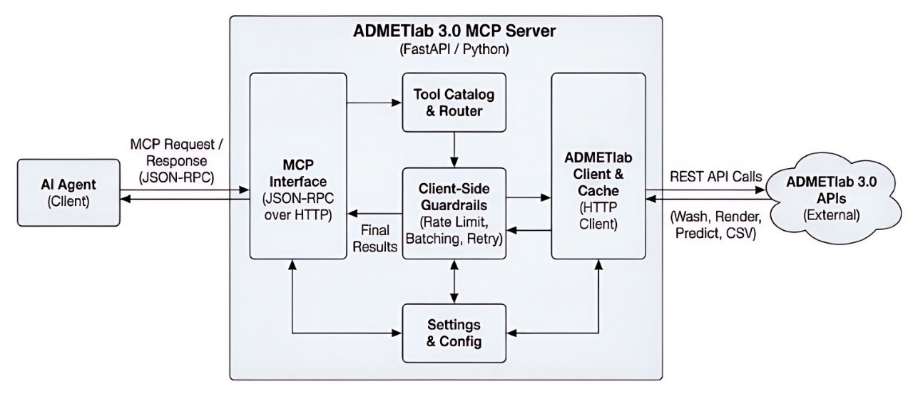

[](https://github.com/ToxMCP/admetlab-mcp/actions/workflows/ci.yml)

## Architecture



[](https://doi.org/10.64898/2026.02.06.703989)
[](./LICENSE)
[](https://github.com/ToxMCP/admetlab-mcp/releases)
[](https://www.python.org/)

# ADMETlab MCP (ADMETlab 3.0 MCP Server)

> Part of **ToxMCP** Suite → https://github.com/ToxMCP/toxmcp


**Public MCP endpoint for the ADMETlab 3.0 API.**  
Expose molecule washing, SVG rendering, ADMET prediction, and CSV retrieval to any MCP-aware agent (Codex CLI, Gemini CLI, Claude Code, etc.).

## What's new in v0.1.2

This reliability patch corrects the live ADMETlab prediction request contract and makes upstream outages visible to MCP clients.

- `predict_admet` sends one string-valued SMILES request to `/api/single/admet` per molecule; the nonexistent `/api/admet` endpoint is no longer called.
- `uncertain` remains accepted for compatibility but is deprecated, ignored, and never sent upstream.
- Upstream 5xx/timeouts return `isError: true` with an actionable `upstream_unavailable` result instead of disconnecting the MCP call.
- `/readyz` reports prediction status as `unknown`, `available`, or `degraded` while molecule washing and rendering remain available.
- Successful tool results include an explicit ADMETlab source label and read-only annotations.

> **Known upstream limitation (observed 2026-07-22):** ADMETlab's live `/api/single/admet` endpoint currently returns a server-side `BSEP` error even for valid molecules. v0.1.2 fixes this MCP server's request format and reports that outage honestly; it cannot repair ADMETlab's external model service.

## What's new in v0.1.1

This patch release restores standards-compliant initialization for strict MCP clients, including Claude Desktop through `mcp-remote`.

- `capabilities.tools` is now advertised as an object.
- The HTTP transport accepts `notifications/initialized` and responds to notifications with `202 Accepted` and no body.
- Successful tool calls return standard MCP content blocks plus matching `structuredContent`.

## Why this project exists

ADMETlab 3.0 provides ADMET property calculations, washing, and visualization. Researchers often script against the API or copy/paste results; MCP packaging makes these workflows discoverable and callable by LLM copilots with guardrails and structured schemas.

---

## Feature snapshot

| Capability | Description |
| --- | --- |
| 🌐 **MCP over HTTP** | JSON-RPC `/mcp` endpoint with lifecycle + tool catalog. |
| 🧪 **ADMET Tools** | Wash molecules, render SVGs, run ADMET predictions, fetch CSV outputs. |
| 🛡️ **Client-side Guardrails** | Rate limit (<=5 rps), up to 1000 SMILES per MCP call, per-molecule upstream requests, and retries/backoff. |
| 📜 **Schema-first** | Pydantic models + JSON Schema surfaced via `tools/list`. |
| 🔎 **Observability Ready** | Structured JSON logs with correlation IDs; hooks for metrics/audit. |

---

## Quickstart TL;DR

```bash
# 1) install
python -m venv .venv
source .venv/bin/activate
pip install -e ".[dev]"

# 2) configure
cp .env.example .env

# 3) run
uvicorn admetlab_mcp.transport.http:app --host 127.0.0.1 --port 8200

# 4) verify
curl -s http://localhost:8200/health | jq .
curl -s http://localhost:8200/readyz | jq .
curl -s http://localhost:8200/mcp \
  -H "Content-Type: application/json" \
  -d '{"jsonrpc":"2.0","id":1,"method":"tools/list","params":{}}' | jq .
```

## Quick start

```bash
python -m venv .venv
source .venv/bin/activate
pip install -e ".[dev]"
cp .env.example .env
uvicorn admetlab_mcp.transport.http:app --host 127.0.0.1 --port 8200
```

MCP HTTP endpoint: `http://localhost:8200/mcp`  
Health: `http://localhost:8200/health`
Readiness: `http://localhost:8200/readyz`

> Prediction uses the live `/api/single/admet` contract. If ADMETlab is unavailable, `predict_admet` returns a visible tool error and `/readyz` reports `degraded`; this does not prevent `wash_molecule` or `render_molecule_svg` from working.

---

## Configuration

Settings use `pydantic-settings` with `.env` support (prefix `ADMETLAB_`):

| Variable | Default | Description |
| --- | --- | --- |
| `ADMETLAB_BASE_URL` | `https://admetlab3.scbdd.com` | Base URL for all requests. |
| `ADMETLAB_TIMEOUT_SECONDS` | `30` | HTTP timeout. |
| `ADMETLAB_RETRY_ATTEMPTS` | `3` | Retry attempts on 5xx/429. |
| `ADMETLAB_RETRY_BACKOFF` | `0.5` | Initial backoff seconds (exponential). |
| `ADMETLAB_RPS_LIMIT` | `5` | Client-side requests per second cap. |
| `ADMETLAB_BATCH_SIZE` | `1000` | Maximum SMILES accepted by one MCP call. |
| `ADMETLAB_FEATURE_DEFAULT` | `false` | Default `feature` flag for ADMET. |
| `ADMETLAB_UNCERTAIN_DEFAULT` | `false` | Deprecated compatibility setting; not sent upstream. |
| `ADMETLAB_ADMET_ENDPOINT` | `/api/single/admet` | Single-SMILES ADMET endpoint. |
| `ADMETLAB_ADMET_FALLBACK_ENDPOINTS` | _empty_ | Deprecated compatibility setting; automatic fallback is disabled. |
| `ADMETLAB_API_KEY` | _empty_ | Reserved for future auth. |
| `ADMETLAB_LOG_LEVEL` | `INFO` | Log level. |

---

## Tool catalog

| Tool | Upstream | Description |
| --- | --- | --- |
| `wash_molecule` | `POST /api/washmol` | Standardize molecules; returns cleaned SMILES list. |
| `render_molecule_svg` | `POST /api/molsvg` | Render molecule SVG; optional `figsize` `[w,h]`. |
| `predict_admet` | `POST /api/single/admet` | One request per SMILES, aggregated under `batches`; returns a visible MCP error while the upstream predictor is unavailable. |
| `fetch_admet_csv` | `POST /api/admetCSV` | Fetch CSV results by `taskId`; response includes headers and content. |

Lifecycle: `initialize`, `notifications/initialized`, `shutdown`, and `exit` are exposed via `/mcp`. Tool schemas are discoverable via `tools/list`.

---

## Running the server

```bash
uvicorn admetlab_mcp.transport.http:app --host 127.0.0.1 --port 8200
```

Sample MCP calls (HTTP):

```bash
# initialize
curl -s http://localhost:8200/mcp \
  -H "Content-Type: application/json" \
  -d '{"jsonrpc":"2.0","id":1,"method":"initialize","params":{"protocolVersion":"2025-06-18","capabilities":{},"clientInfo":{"name":"curl-smoke","version":"1.0"}}}'

# list tools
curl -s http://localhost:8200/mcp \
  -H "Content-Type: application/json" \
  -d '{"jsonrpc":"2.0","id":2,"method":"tools/list","params":{}}'

# wash molecule
curl -s http://localhost:8200/mcp \
  -H "Content-Type: application/json" \
  -d '{"jsonrpc":"2.0","id":3,"method":"tools/call","params":{"name":"wash_molecule","arguments":{"SMILES":"CCO"}}}'

# prediction demo: inspect either structuredContent on success or isError/content
# while the upstream ADMETlab predictor is degraded
curl -s http://localhost:8200/mcp \
  -H "Content-Type: application/json" \
  -d '{"jsonrpc":"2.0","id":4,"method":"tools/call","params":{"name":"predict_admet","arguments":{"SMILES":"CCO"}}}' \
  | jq '.result | {isError, content, structuredContent, _meta}'
```

---

## Output artifacts

- Tool results are returned as text content blocks under `result.content` and as machine-readable JSON under `result.structuredContent`.
- Source descriptors are returned visibly in `content` and programmatically in `result._meta.sources`.
- Prediction outages are returned as `isError: true` tool results; they are not successful predictions and should be stated as such.
- CSV fetch includes raw text plus headers for client-side saving.
- SVGs are returned inline as strings from `render_molecule_svg`.

---

## Security checklist

- Client-side rate limiting honors service guidance (`<=5 rps`).
- Input validation and batch caps to avoid oversize requests.
- Optional API key header placeholder for future auth.
- Prefer running behind TLS-terminating proxy; restrict exposure to trusted clients.
- Tool annotations are read-only hints. Permission persistence is controlled by the MCP client (for example Claude Desktop), not by this server.

---

## Development notes

- Tests: `pytest`
- Lint/format: `black . && isort .`
- Known upstream issue: `/api/single/admet` was returning an internal `BSEP` error on 2026-07-22. The server retries transient failures and reports degradation without exposing the upstream traceback.

---

## Contributing

See [`CONTRIBUTING.md`](CONTRIBUTING.md) for development setup and pull request guidance.

## Community and governance

- Code of Conduct: [`CODE_OF_CONDUCT.md`](CODE_OF_CONDUCT.md)
- Security policy: [`SECURITY.md`](SECURITY.md)
- Release checklist: [`RELEASE_CHECKLIST.md`](RELEASE_CHECKLIST.md)
- Changelog: [`CHANGELOG.md`](CHANGELOG.md)

## License

This project is licensed under the [Apache License 2.0](LICENSE).

## Acknowledgements / Origins

ToxMCP was developed in the context of the **VHP4Safety** project (see: https://github.com/VHP4Safety) and related research/engineering efforts.

Funding: Dutch Research Council (NWO) — NWA.1292.19.272 (NWA programme)

This suite integrates with third-party data sources and services (e.g., EPA CompTox, ADMETlab, AOP resources, OECD QSAR Toolbox, Open Systems Pharmacology). Those upstream resources are owned and governed by their respective providers; users are responsible for meeting any access, API key, rate limit, and license/EULA requirements described in each module.

## ✅ Citation

Djidrovski, I. **ToxMCP: Guardrailed, Auditable Agentic Workflows for Computational Toxicology via the Model Context Protocol.** bioRxiv (2026). https://doi.org/10.64898/2026.02.06.703989

```bibtex
@article{djidrovski2026toxmcp,
  title   = {ToxMCP: Guardrailed, Auditable Agentic Workflows for Computational Toxicology via the Model Context Protocol},
  author  = {Djidrovski, Ivo},
  journal = {bioRxiv},
  year    = {2026},
  doi     = {10.64898/2026.02.06.703989},
  url     = {https://doi.org/10.64898/2026.02.06.703989}
}
```

Citation metadata: [`CITATION.cff`](./CITATION.cff)


## Verification (smoke test)

Once the server is running:

```bash
# health
curl -s http://localhost:8200/health | jq .
curl -s http://localhost:8200/readyz | jq .

# list MCP tools
curl -s http://localhost:8200/mcp \
  -H "Content-Type: application/json" \
  -d '{"jsonrpc":"2.0","id":1,"method":"tools/list","params":{}}' | jq .
```
